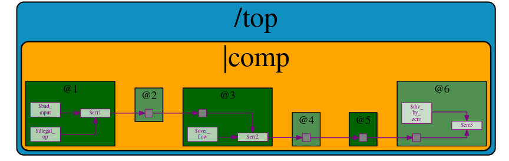

# RISC-V based MYTH
This repository summarises work done on the RISC-V workshop hosted by **Kunal Ghosh** of VSD Corp. Pvt. Ltd.<br />

# Day 1
<details>
  <summary>Introduction</summary>
  <br />
  RISC-V is an open-source instruction set architecture (ISA) for computer processors.<br>
  An instruction set architecture defines the set of instructions that a processor can execute and the organization and behaviour of those instructions.
  RISC-V is unique in that any single company or organization does not own it. and it is freely available for anyone to use, modify, and implement without 
  the need for licensing fees or proprietary restrictions.<br />  
  <br />
  The RISC-V project began at the University of California, Berkeley in 2010, and it has since gained significant traction in both academia and industry.
  Its open nature has led to a growing ecosystem of hardware and software developers collaborating to create a wide range of products, from simple embedded 
 devices to high-performance supercomputers.
  <br /><br/>

  

  <br/>
  Application software (apps) and hardware are linked by 'system software'.There are various layers of **system software**. This includes major components like   
  Compiler and Assembler.<br />
  <br />
  The compiler compiles high-level codes like C and C++ to Instructions(eg: the codes inside .exe files) that can be read by the Assembler.<br />
  The Assembler converts it into binary codes which the machine can understand. The instructions act as an interface between the high-level language and the 
  machine language.<br />
  <br />
  The converted binary is then given to an RTL snippet that understands the instruction. This is done by a Hardware Description Language (HDL).<br />
  This is basically called RTL implementation and a netlist is being generated. with this, a physical design implementation of the design is generated.<br />

</details>
<details>
  <summary>Lab 1 : RISC-V software toolchain | GCC Compile and Disassemble</summary>
  <br />	
  First, let us write a basic C program to find the sum of n numbers.<br />
  
  ```
  #include <stdio.h>
  int main(){
  int n = 100,sum=0,i;
  for(i=0;i<=n;i++)
  {
	  sum= sum +i;
  }
  printf("The sum of %d consecutive numbers is :%d \n",n,sum);
  return 0;
  }
```
  We need to install the necessary Rriscv_workshop_collateralsISC-V toolchain for RISC-V activities.<br />
  Steps to set up the toolchain:
  1. git clone https://github.com/kunalg123/riscv_workshop_collaterals.git using terminal
  2. go to the **riscv_workshop_collaterals** folder.
  3. On terminal **chmod 755 run.sh** and then **./run.sh**
  4. During the installation, an error might pop up at the end. Ignore it for now.
  5. The riscv_toolchain folder will be on the **home**.
  6. change directory(cd) to  /riscv_toolchain/iverilog/
  7. Then do the following commands:
      
      ```
      git checkout --track -b v10-branch origin/v10-branch
      git pull 
      chmod 777 autoconf.sh 
      ./autoconf.sh 
      ./configure 
      make
      sudo make install
      ```
   8. We need to set the PATH variable in .bashrc.Do the following commands.<br />
      
      ```
      gedit .bashrc
      **within .bashc file**
      export PATH="/home/<username>/riscv_toolchain/riscv64-unknown-elf-gcc-8.3.0-2019.08.0-x86_64-linux-ubuntu14/bin:$PATH"
      **within .bashrc file **
      source .bashrc
      ```

   <br />
   So to compile the .c file with the RISC-V compiler tool. we are using the below command.<br /><br />
   
   ```
   riscv64-unknown-elf-gcc -O1 -mabi=lp64 -march=rv64i -o <filename>.o <filename>.c
   ```
   <br />
   To view the assembly code for the same, do the following command.<br /><br />
   
   ```
   riscv64-unknown-elf-objdump -d <filename>.o
   ```
   


   To view the detailed code do the following command.<br />

   ```
   riscv64-unknown-elf-objdump -d <filename>.o | less
   ```
   To find **main** we type /main in the **:<command>** and press the 'N' button.<br />
   
   

   In the above screenshot, we can see the memory address for the instructions. Where it starts and where another one begins.<br />
   If we subtract '**00000000000101c0**'(end of main) and '**0000000000010184**'(beginning of main) and then divide by 4 we get 15. Which is the number of 
   instructions within that particular block(main).<br />
   <br />

   Now let's execute the below commands:<br/>

   ```
   riscv64-unknown-elf-gcc -Ofast -mabi=lp64 -march=rv64i -o <filename>.o <filename>.c
   riscv64-unknown-elf-objdump -d <filename>.o | less
   ```
  

  
In the above screenshot, if we subtract '**00000000000100e0**'(end of main) and '**00000000000100b0**'(beginning of main) and then divide by 4 we get 12. Which 
is the number of instructions within that particular block(main).<br />
   <br />

  
</details>
<details>
   <summary>Lab 2 : Spike Simulation and Debug</summary>
    <br />
    In this lab, we are going to Debug the '.o' file that we generated using the RISC-V compiler.<br />
    For that, we use the following command:

    ```
    spike pk <filename>.o // to give an output
    spike -d pk <filename>.o //open debugger
    ```
   The debugger mode will be open.<br />
   We use the until command to move to a particular address.<br />
   Here we are debugging the highlighted instructions.<br /><br />
   
   <br />
   
   The following commands are used in the debugger:<br />
   ```
   until pc 0 100b0 //moves the program counter(PC) to the address
   reg 0 a2    //views content of the address
   **We press enter to go to the next instruction**
   ```

   
   <br />

   In the above screenshot, we can see the register pertaining to a particular instruction getting updated.<br />
	
</details>

<details>
    <summary>Integer number representation</summary>
    <br />
    Integer number representation refers to the method used to represent whole numbers (integers) within a computer's memory or processor. There are different   
    ways to represent integers in binary form, which is the fundamental language of computers. <br />
    On a high level, we recognize numbers as decimals but computers recognize them as binary (1's or 0's). So binary conversion is key here.<br/><br />

  ## Unsigned Numbers
  <br />
  Unsigned numbers are a type of integer representation that only includes non-negative integers. These numbers do not have a sign bit to indicate whether they 
  are positive or negative; they   
  represent values greater than or equal to zero. In binary representation, all the bits are used to represent the magnitude of the number, and there is no need 
  to allocate a bit for the sign.

  Unsigned numbers are often used in situations where negative values are not relevant or meaningful. They can represent quantities, indices, counts, and other 
  values that are always positive or zero.
    

	
   It is important to note that:
   - 1 byte is 8 bits
   - 1 word is 4 bytes
   - 2 words (double word) is 8 bytes
   <br />
   So A word is 32 bits and a double word is 16 bits.<br />
   <br />
   ### 2 bit
   <br />
   the total number of representations = **2^2=4**<br />
   0 -> (2^2 -1)<br />

   <br />
   ### 4 bit
   <br />
   the total number of representations = **2^4=16**<br />
   0 -> (2^4 -1)<br />

   <br />
   Similarly, we can follow the same for the **RISC-V** which has 64-bit Architecture.
   <br />
   the total number of representations = **2^16**<br />
   0 -> (2^16 -1)<br />

   ## Signed Numbers
   <br />
   Signed numbers are a type of integer representation that includes both positive and negative integers. In computer systems, signed numbers are represented 
   using various methods to indicate the 
   sign and magnitude of the number.
   <br />
   Two's complement is the most widely used method for representing signed integers in computers. In this method, the leftmost bit (the most significant bit) is 
   the sign bit. A value of 0 in the 
   sign bit represents a positive number, and a value of 1 represents a negative number. The remaining bits represent the magnitude of the number in binary form.
   <br /><br />
   To negate a number in two's complement, you invert all the bits (change 0s to 1s and vice versa) and then add 1 to the result. This method simplifies 
   arithmetic operations and eliminates the need for a separate subtraction circuit.

</details>
<details>
  <summary>Lab Signed and unsigned</summary>
  
### LAB 3A 

Here we are going to execute the following code.<br />
The output is given for unsigned numbers and we are just viewing if it is within the range or it goes out in which case displays either the minimum or maximum values.<br />

```

#include <stdio.h>
#include <math.h>
int main()
{
    unsigned long long int max = (unsigned long long int)(pow(2,64)-1);       //statement 1  //will display the max number
    //unsigned long long int max = (unsigned long long int)(pow(2,127)-1);    //statement 2  //(out of range) will display the max number(within range)
    //unsigned long long int max = (unsigned long long int)(pow(2,10)-1);     //statement 3  //will display number (since it is within range)
    //unsigned long long int max = (unsigned long long int)(pow(2,64) * -1);  //statement 4  //will display 0 since it is a -ve number
    printf("highest number represented by unsigned long long int is %llu\n",max);
    return 0;
}
```
The output is given below in sequential order.<br />


### LAB 3B

Here we are going to execute the following code.<br />

```
#include <stdio.h>
#include <math.h>
int main()
{
    long long int max = (long long int)(pow(2,63)-1);        //will display the max number
    long long int min = (long long int)(pow(2,63) * -1);     //will display the min number
    printf("highest number represented by long long int is %lld\n",max);
    printf("lowest number represented by long long int is %lld\n",min);
    return 0;
}
```
The below screenshot shows the output of the same.<br />


	
</details>

# Day 2

<details>
  <summary>Introduction to ABI and verification Flows</summary>
  <br />
  The Application Binary Interface (ABI) is a set of rules and conventions that dictate how binary code communicates and interacts with other binary code, usually across different components of a 
  software system or even across different software systems. In simpler terms, it defines how functions are called, how data is organized, and how components cooperate at the binary level.<br />

  There are multiple layers between the Application program and the Hardware. One of these layers is the ABI.<br />
  
  
  <br />
  ABIs are crucial for enabling interoperability between different software components, whether they're compiled by the same or different compilers, or even 
  running on different hardware 
  architectures. Operating systems, libraries, and various programming languages need to adhere to a specific ABI to ensure that their binary components can work 
  together seamlessly.<br />
  <br />
  ## What is XLEN?
  <br />
  'XLEN' typically refers to the X Register Length. The XLEN value represents the number of bits in the general-purpose registers, which are used for 
  storing data and performing computations. In a RISC-V system with a 32-bit XLEN, the general-purpose registers would be 32 bits wide.<br /> 
  Similarly, in a RISC-V system with a 64-bit XLEN, the general-purpose registers would be 64 bits wide. The XLEN value has a significant impact on the 
  performance, memory-addressing capabilities, and overall capabilities of the processor.<br />
  A larger XLEN allows for more addressable memory space and potentially more complex computations. However, it also comes with increased hardware. The XLEN 
  value has a significant impact on the performance, memory-addressing capabilities, and overall capabilities of the processor. <br />

  There are two ways in which we can load data  into the 64-bit register.<br />
  - Can be directly loaded
  - Can be loaded into memory and then loaded to reg

  <br />
  RISC-V follows the little-endian condition.<br />
  Little Endian is a byte order or endianness used in computer architecture to represent multi-byte data types such as integers and floating-point numbers in 
  memory.<br /> 
  In a Little Endian system, the least significant byte (LSB) of a multi-byte value is stored at the lowest memory address, while the most significant byte (MSB)
  is stored at the highest memory address.<br /><br />
  RISC-V little-endian is illustrated by the figure below:<br />
  
  
  <br />
  
</details>
<details>
  <summary>Load,Add and Store Instructions</summary>
   <br />

   Firstly let us load an array 'M' of 3 double-word as shown in the below figure.<br />
	
   
   <br />
   Here let us load it into the 'x8' register. let's say reg 'x23' contains the base address of array **M** and it is '0'.<br />
   as in it starts at 0. Let us consider the instruction below,**ld(load doubleword)**.<br />

   ```
   ld   x8, 16(x23)
   ```
  breaking down the instruction:<br />
  - ld: load double
  - x8: destination register 'rd'
  - 16: offset immediate
  - x23: Souce register 'rs1'
 <br />
 Here the immediate offset gets added to the contents of the source register to form the final address and loads the value from '16' in the figure above into
 the x8 reg.<br />
 

<br />
The diagram above represents the instruction(**I-type**).<br />
It  is important to note that even though the register size is of 64-bit in RV64 the instruction size is 32-bit.<br />
The opcode and the funct3 determine the type of instruction, whether it is an 'ld' or 'addi' etc.<br />
rs1 and rd are the source and destination registers respectively.<br />
The immediate bits will contain the offset.<br />
<br />
Let us look at another instruction,**add**.<br />

```
add x8, x24,x8
```
<br />
The structure for the above command is given below (R-type), unlike the one before here there are two source registers instead of one and another funct 
register also. <br />


There is another instruction going by **sd(store doubleword)**.<br />

```
sd x8, 8(x23)
```
Since there is a limited availability of registers we need to store values to registers after loading and doing operations.<br />
The Instruction structure will look like so(**S-type**):<br />

<br />

### Instruction set in RISC-V
There are mainly three types of Instructions:<br />
1. I-type: I-type instructions are used for operations that involve an immediate value (constant) and a register.
2. R-type: R-type instructions are used for operations that involve two source registers and a destination register.<br />
   	   These instructions typically perform arithmetic, logical, or bitwise operations.
3. S-type: S-type instructions are used for memory store operations.<br/>
 	   These instructions store data from a source register in memory at an address determined by an offset from another register.


</details>

<details>
  <summary>LAB work using ABI function calls</summary>	
    <br />
    For this lab, we are going to create a C program and simulate it with a Function call.<br />
    We are going to be following the below algorithm.<br />
    
   
   <br />
   The C program used is:<br />

   ```
   #include <stdio.h>
   extern int load(int x,int y);
   int main()
	{
    	int result = 0;
   	int count =9;
    	result = load(0x0,count+1);
    	printf("Sum of numbers from 1 to %d is %d\n",count,result);
	}
   ```
   We also create a load.S file as below:<br />
   
   ```
   .section .text
   .global load
   .type load, @function

   load: 
        add   a4,a0,zero    //initialize sum register a4 with 0x0
        add   a2,a0,a1      //store count of 10 in reg a. reg a1 is loaded with 0xa(decimal 10) from main
        add   a3,a0,zero    //initialize intermediate sum reg a3 by 0x0

   loop:
	add   a4,a3,a4     // Incremental addition
        addi  a3,a3,1      // Increment intermediate register by 1
        blt   a3,a2,loop   // If a3 is less than a2,branch to label <loop> 
        add   a0,a4,zero   // store final result to reg a0 so that it can be read by main pgm
        ret

   ```
We do the following commands in the terminal:<br />

```
riscv64-unknown-elf-gcc -ofast -mabi=lp64 -march=rv64i -o <filename>.o <filename>.c load.S
spike pk <filename>.o
riscv64-unknown-elf-objdump -d <filename>.o | less

```
The output screenshots are shown below:<br />


</details>

<details>
<summary>Basic verification flow using verilog</summary>
<br />
 In this lab, we are basically going to generate a hex file and a bitstream of the same code done above.<br />
 We run the below code to generate the same.<br />

 ```
 riscv64-unknown-elf-gcc -c -mabi=ilp32 -march=rv32im -o <filename>.o <filename>.c
 riscv64-unknown-elf-gcc -c -mabi=ilp32 -march=rv32im -o load.o load.S

 riscv64-unknown-elf-gcc -c -mabi=ilp32 -march=rv32im -o syscalls.o syscalls.c
 riscv64-unknown-elf-gcc -mabi=ilp32 -march=rv32im -Wl,--gc-sections -o firmware.elf load.o <filename>.o syscalls.o -T riscv.ld -lstdc++
 chmod -x firmware.elf
 riscv64-unknown-elf-gcc -mabi=ilp32 -march=rv32im -nostdlib -o start.elf start.S -T start.ld -lstdc++
 chmod -x start.elf
 riscv64-unknown-elf-objcopy -O verilog start.elf start.tmp
 riscv64-unknown-elf-objcopy -O verilog firmware.elf firmware.tmp
 cat start.tmp firmware.tmp > firmware.hex
 python3 hex8tohex32.py firmware.hex > firmware32.hex
 rm -f start.tmp firmware.tmp
 iverilog -o testbench.vvp testbench.v picorv32.v
 chmod -x testbench.vvp
 vvp -N testbench.vvp

 ```

The file firmware.hex is the hex file and firmware32.hex is the bitstream generated.<br />
The below file is firmware.hex.<br />

<br /><br />
The below file is firmware32.hex  (bitstream).<br />


</details>

# Day 3
<details>
<summary>Digital logic with TL-Verilog and Makerchip</summary>
<br />
	
In this part of the workshop, we are going to look at:<br />
 1. Logic gates
 2. MakerChip platform(IDE)
 3. Combinational Logic
 4. Sequential Logic
 5. Piplining logic
 6. Slate

## Introduction to logic gates

Logic gates are fundamental building blocks of digital circuits. They are electronic devices that perform basic logical operations
on one or more binary inputs (usually 0 or 1) to produce a single binary output. These gates are the foundation of all digital systems, 
including computers, microcontrollers, and other digital devices. Logic gates are typically implemented using electronic 
components such as transistors.<br />

The most common logic gates are:<br />
1. NOT
2. AND
3. OR
4. NAND
5. NOR
6. XOR
7. XNOR


<br />

## Makerchip
[Makerchip](https://makerchip.com/) is an online platform that provides an integrated development environment (IDE) for digital design and verification using 
SystemVerilog and TL  Verilog. It allows engineers, students, and enthusiasts to design and simulate digital circuits, develop RTL (Register Transfer Level) 
code, and explore hardware design concepts without requiring the local installation of tools.<br />

To Familiarize oneself with the IDE there are tutorials on the platform where we can experiment.<br />

## Combinational Logic

For this, I have started with a basic inverter logic program, [logical operations](images/combinational.png) and a [multi-bit mux program](images/mux2.png). Here we are using Transitional Level Verilog(TL-V), which is quite different from standard verilog code, syntax varies quite a bit. There is no need to declare ```$out``` and ```$in``` unlike Verilog. There is also no need to assign ```$in```. A random stimulus is provided, and a warning is produced.<br />

Attaching output of the inverter in Makerchip IDE for reference:<br />

<br />
<br />

Now let us do a bit more of a complex combinational circuit. Let us create the following circuit.<br />
Below shown is a calculator which uses a mux.<br />


<br /><br />
The code for this [here](codes/comibational_calc.tlv) and the output is shown as below.<br />


## Sequential Logic

Sequential Circuits will always use a clock. The basic element required for a circuit to be sequential is a D-FF. The DFF transitions<br />
to the next state on the positive edge of the clock.<br />
A basic circuit design implementing a [Fibonacci series](images/fibbanochi.png) is done on Makerchip.<br />
Also, a free-running counter having the following design is implemented. <br /><br />

<br />
Right-click open the [code](codes/freecounter.tlv) to get the tlv code for the free running counter.<br />
<br />
The output for the same is shown below.<br />


</details>
<details>
<summary>LAB Sequential Calculator</summary>
<br />
Here we are going to implement a FF to the combinational calculator we did before.<br />
The design of the sequential calculator is like so:<br />
<br />
	

<br />
The output of the previous clock cycle is assigned to the input1.<br />
The tlv code is available [here](codes/seq_calc.tlv).<br />
<br />
The output for the same is shown below.<br />

</details>

<details>
<summary>Pipeling Logic</summary>
<br />
Here firstly we are trying to make the following pipeline and see the output waveform.<br />
	

<br />
Click to view the [code](codes/pipelining.tlv). <br />
The output in Makerchip is shown below.<br />


## Two-cycle calculator

We are required to write code and view the waveform of the below design.<br />


<br />
As shown above, the 2-cycle calculator clears the output alternatively and the output of given inputs is observed at the next cycle.<br />
Click to view the [code](codes/calc_pipe.tlv).<br />
<br />
The output on Makerchip is shown below.<br />


</details>

<details>
<summary>Validity</summary>
<br />
First, we shall see a distance accumulator coupled with a Pythagorean pipeline as shown below.
<br />
	

<br />
Click to view the code for the [Distance accumulator](codes/pythpipedis.tlv).<br />
<br />
The output for it generated in MakerChip is given below.<br />

<br />

## Cycle Calculator with Validity

The following design is what we are required to create.<br />

<br />

Click here to open the [code](codes/calcvalid.tlv)<br />
<br />
The output in Makerchip is given below.<br />


## Cycle Calculator with Validity and memory

The design we have to implement is given below.<br />


Click here to [open code](codes/memvalgitid.tlv).<br />
<br />
The output in Makerchip is given below.<br />


</details>
<details>
<summary>Wrapping up</summary>
<br />
Here we are just going to look at some special codes.<br />

 ## Conways Game of life

 The Game of Life, also known simply as "Life," is a cellular automaton devised by mathematician John Conway in 1970. It's not a traditional game with players,  
 but rather a simulation that follows a set of rules to create patterns and behaviours.<br />
<br />
The Game of Life takes place on an infinite grid of cells, each of which can be in one of two states: alive or dead. The state of each cell evolves over discrete 
time steps based on its current state and the states of its eight neighbouring cells. The evolution is determined by the following rules:<br />

1. Any live cell with fewer than two live neighbours dies as if caused by underpopulation.
2. Any live cell with two or three live neighbours survives to the next generation.
3. Any live cell with more than three live neighbours dies, as if by overpopulation.
4. Any dead cell with exactly three live neighbours becomes a live cell, as if by reproduction.
<br />


<br />

## Pythagoras's theorem


<br />
The output on Makechip is:<br /> 


</details>

# Day 4 
<details>
<summary>Introduction to RISC-V microacrchitecture</summary>
<br />
Microarchitecture refers to the internal design and organization of a CPU that implements a particular ISA.<br />
RISC-V CPUs can have different microarchitectures that optimize for various aspects such as performance, power efficiency, and area (size of the chip).<br />
Here are some key features and concepts commonly found in RISC-V microarchitecture: <br />
	
1. Instruction Fetch (IF)
2. Instruction Decode (ID)
3. Execution Units
   
It's important to note that RISC-V is an instruction set architecture, and microarchitectures based on RISC-V can vary widely depending on the design goals of
the processor manufacturer. Different companies and research institutions may develop their own microarchitectures that implement the RISC-V ISA in unique ways,
tailored to specific use cases and performance goals.<br />
<br />
Here we are designing the basic processor of 3 stages fetch, decode and execute based on RISC-V ISA.<br />
For starting the implementation a starter code is present in the below link.<br />

```
https://github.com/stevehoover/RISC-V_MYTH_Workshop
```
The block diagram of a basic RISC-V microarchitecture is shown in the figure below.<br />


<br />
Using the Makerchip platform the implementation of the RISC-V microarchitecture or core is done.<br /> 
For starting the implementation a starter code present here is used. The starter code shell consists of:

1. RISC-V Assembler
2. Test program
3. Visualization(Viz)
4. Commented code for register, file and memory.
     
</details>

<details>
<summary>Fetch and Decode</summary>
<br />
Here we are going to design a simple RISC-V Core CPU as per the below diagram.<br />


The [sample template](codes/day4/template.tlv) is given below.<br />

```
\m4_TLV_version 1d: tl-x.org
\SV
   // This code can be found in: https://github.com/stevehoover/RISC-V_MYTH_Workshop
   
   m4_include_lib(['https://raw.githubusercontent.com/BalaDhinesh/RISC-V_MYTH_Workshop/master/tlv_lib/risc-v_shell_lib.tlv'])

\SV
   m4_makerchip_module   // (Expanded in Nav-TLV pane.)
\TLV

   // /====================\
   // | Sum 1 to 9 Program |
   // \====================/
   //
   // Program for MYTH Workshop to test RV32I
   // Add 1,2,3,...,9 (in that order).
   //
   // Regs:
   //  r10 (a0): In: 0, Out: final sum
   //  r12 (a2): 10
   //  r13 (a3): 1..10
   //  r14 (a4): Sum
   // 
   // External to function:
   m4_asm(ADD, r10, r0, r0)             // Initialize r10 (a0) to 0.
   // Function:
   m4_asm(ADD, r14, r10, r0)            // Initialize sum register a4 with 0x0
   m4_asm(ADDI, r12, r10, 1010)         // Store count of 10 in register a2.
   m4_asm(ADD, r13, r10, r0)            // Initialize intermediate sum register a3 with 0
   // Loop:
   m4_asm(ADD, r14, r13, r14)           // Incremental addition
   m4_asm(ADDI, r13, r13, 1)            // Increment intermediate register by 1
   m4_asm(BLT, r13, r12, 1111111111000) // If a3 is less than a2, branch to label named <loop>
   m4_asm(ADD, r10, r14, r0)            // Store final result to register a0 so that it can be read by main program
   
   // Optional:
   // m4_asm(JAL, r7, 00000000000000000000) // Done. Jump to itself (infinite loop). (Up to 20-bit signed immediate plus implicit 0 bit (unlike JALR) provides byte address; last immediate bit should also be 0)
   m4_define_hier(['M4_IMEM'], M4_NUM_INSTRS)

   |cpu
      @0
         $reset = *reset;


      // YOUR CODE HERE
      // ...

      // Note: Because of the magic we are using for visualisation, if visualisation is enabled below,
      //       be sure to avoid having unassigned signals (which you might be using for random inputs)
      //       other than those specifically expected in the labs. You'll get strange errors for these.

   
   // Assert these to end simulation (before Makerchip cycle limit).
   *passed = *cyc_cnt > 40;
   *failed = 1'b0;
   
   // Macro instantiations for:
   //  o instruction memory
   //  o register file
   //  o data memory
   //  o CPU visualization
   |cpu
      //m4+imem(@1)    // Args: (read stage)
      //m4+rf(@1, @1)  // Args: (read stage, write stage) - if equal, no register bypass is required
      //m4+dmem(@4)    // Args: (read/write stage)
      //m4+myth_fpga(@0)  // Uncomment to run on fpga

   //m4+cpu_viz(@4)    // For visualisation, argument should be at least equal to the last stage of CPU logic. @4 would work for all labs.
\SV
   endmodule
```
## PC Logic

In RISC-V, the Program Counter (PC) is a special-purpose register that holds the memory address of the next instruction to be fetched and executed.<br />
The PC is also commonly referred to as the instruction pointer (IP) in other architectures.<br />
The PC is a crucial component of the processor's control flow, as it determines the sequence of instructions that are fetched and executed.<br />


<br />
The below piece of [code](codes/day4/pc.tlv) is implemented.<br />

```
|cpu
      @0
         $reset = *reset;
         
         $pc[31:0] = >>1$reset ? 32'b0 : >>1$pc + 32'd4;
```
The output of the same in Makerchip is given below:<br />


<br />

## Fetch

Instruction fetch is the initial stage of the instruction processing pipeline in a RISC-V processor.<br />
In this stage, the processor retrieves the instruction located at the memory address pointed to by the Program Counter (PC),<br />
and prepares it for further processing.<br />

The below diagram is what we need to implement in this step.<br />


<br />

The [code](codes/day4/fetch_issue.tlv) we have to change is:

```

|cpu
      @0
         $reset = *reset;
         
         $pc[31:0] = >>1$reset ? 32'b0 : >>1$pc + 32'd4;
         
         
         
      // Note: Because of the magic we are using for visualisation, if visualisation is enabled below,
      //       be sure to avoid having unassigned signals (which you might be using for random inputs)
      //       other than those specifically expected in the labs. You'll get strange errors for these.

   
   // Assert these to end simulation (before Makerchip cycle limit).
   *passed = *cyc_cnt > 40;
   *failed = 1'b0;
   
   // Macro instantiations for:
   //  o instruction memory
   //  o register file
   //  o data memory
   //  o CPU visualization
   |cpu
      m4+imem(@1)    // Args: (read stage)
      //m4+rf(@1, @1)  // Args: (read stage, write stage) - if equal, no register bypass is required
      //m4+dmem(@4)    // Args: (read/write stage)
   
   m4+cpu_viz(@4)    // For visualisation, argument should be at least equal to the last stage of CPU logic
                      
```

The output as shown on Makerchip is:<br />


The corrected Fetch code block is:<br />


```
|cpu
      @0
         $reset = *reset;
         
         $pc[31:0] = >>1$reset ? 32'b0 : >>1$pc + 32'd4;
      @1
         $imem_rd_addr[M4_IMEM_INDEX_CNT-1:0] = $pc[M4_IMEM_INDEX_CNT+1:2];
         $imem_rd_en = !$reset;
         $instr[31:0] = $imem_rd_data[31:0];
      ?$imem_rd_en
         @1
            $imem_rd_data[31:0] = /imem[$imem_rd_addr]$instr;

// Assert these to end simulation (before Makerchip cycle limit).
   *passed = *cyc_cnt > 40;
   *failed = 1'b0;
   
   // Macro instantiations for:
   //  o instruction memory
   //  o register file
   //  o data memory
   //  o CPU visualization
   |cpu
      m4+imem(@1)    // Args: (read stage)
      //m4+rf(@1, @1)  // Args: (read stage, write stage) - if equal, no register bypass is required
      //m4+dmem(@4)    // Args: (read/write stage)
   
   m4+cpu_viz(@4)    // For visualisation, argument should be at least equal to the last stage of CPU logic
```
The output as shown on Makerchip is:<br />


## Decode
The instruction decode stage is the second stage in the instruction processing pipeline of a RISC-V processor.<br />
In this stage, the fetched instruction is decoded to determine its operation, operands, and any immediate values associated with it.<br />
The instruction decode stage prepares the instruction for execution by the subsequent stages of the pipeline.<br />
There are 6 instructions type in RISC-V :

1. Register (R) type
2. Immediate (I) type
3. Store (S) type
4. Branch (B) type
5. Upper immediate (U) type
6. Jump (J) type


<br />

Instruction type decode: <br />


<br />
The [code](codes/day4/itypedecode.tlv) for this is.<br /> 

```

@1
         $is_u_instr = $instr[6:2] ==? 5'b0x101;
         
         $is_s_instr = $instr[6:2] ==? 5'b0100x;
         
         $is_r_instr = $instr[6:2] ==? 5'b01011 ||
                       $instr[6:2] ==? 5'b011x0 ||
                       $instr[6:2] ==? 5'b10100;
         
         $is_j_instr = $instr[6:2] ==? 5'b11011;
         
         $is_i_instr = $instr[6:2] ==? 5'b0000x ||
                       $instr[6:2] ==? 5'b001x0 ||
                       $instr[6:2] ==? 5'b11001;
         
         $is_b_instr = $instr[6:2] ==? 5'b11000;
```
The output as shown on Makerchip is:<br />

<br />

## Instruction immediate decode


The code below is added.<br />

```
      $imm[31:0] = $is_i_instr ? {{21{$instr[31]}}, $instr[30:20]} :
 		$is_s_instr ? {{21{$instr[31]}}, $instr[30:25], $instr[11:7]} :
			 $is_b_instr ? {{20{$instr[31]}}, $instr[7], $instr[30:25], $instr[11:8], 1'b0} :
				 $is_u_instr ? {$instr[31:12], 12'b0} :
 					 $is_j_instr ? {{12{$instr[31]}}, $instr[19:12], $instr[20], $instr[30:21], 1'b0} :
	              					32'b0;
```

The output as shown on Makerchip is:<br />

<br />

## Lab to extract other instruction fields

Here we are going to try to extract other instruction fields such as $funct7 , $funct3, $rs1 ,$rs2 ,$rd, $opcode.<br />


<br />
Using the code below.<br />

```
	 $rs2[4:0] = $instr[24:20];
         $rs1[4:0] = $instr[19:15];
         $rd[4:0]  = $instr[11:7];
         $opcode[6:0] = $instr[6:0];
         $func7[6:0] = $instr[31:25];
         $func3[2:0] = $instr[14:12];
         
```
The output as shown on Makerchip is:<br />


## Lab to Decode Instruction field based on the Instruction type
Here we are going to try to extract other instruction fields such as $funct7 , $funct3, $rs1 ,$rs2 ,$rd, $opcode based on the instruction type.<br />


Using the code below.<br />

```

	$rs2_valid = $is_r_instr || $is_s_instr || $is_b_instr;
         ?$rs2_valid
            $rs2[4:0] = $instr[24:20];
            
         $rs1_valid = $is_r_instr || $is_i_instr || $is_s_instr || $is_b_instr;
         ?$rs1_valid
            $rs1[4:0] = $instr[19:15];
         
         $funct3_valid = $is_r_instr || $is_i_instr || $is_s_instr || $is_b_instr;
         ?$funct3_valid
            $funct3[2:0] = $instr[14:12];
            
         $funct7_valid = $is_r_instr ;
         ?$funct7_valid
            $funct7[6:0] = $instr[31:25];
            
         $rd_valid = $is_r_instr || $is_i_instr || $is_u_instr || $is_j_instr;
         ?$rd_valid
            $rd[4:0] = $instr[11:7];
```

The output as shown on Makerchip is:<br />


## Lab on individual decode

Here we are going to try to get the instructions that are circled in red.<br />


```

	 $dec_bits [10:0] = {$funct7[5], $funct3, $opcode};
         $is_beq = $dec_bits ==? 11'bx_000_1100011;
         $is_bne = $dec_bits ==? 11'bx_001_1100011;
         $is_blt = $dec_bits ==? 11'bx_100_1100011;
         $is_bge = $dec_bits ==? 11'bx_101_1100011;
         $is_bltu = $dec_bits ==? 11'bx_110_1100011;
         $is_bgeu = $dec_bits ==? 11'bx_111_1100011;
         $is_addi = $dec_bits ==? 11'bx_000_0010011;
         $is_add = $dec_bits ==? 11'b0_000_0110011;
         
```

The output as shown on Makerchip is:<br />


Click [here](codes/day4/fetchdecode.tlv) to view the final code for fetch and decode.

</details>

<details>
<summary>RISC-V Control Logic</summary>

## Execute and Register file read/write

Here we are going to  'read from' and 'write into' the registers.<br />
two read and one write operations can be carried out simultaneously here.<br />

<br />
We are going to use the below code.<br />

```
	 $rf_wr_en = 1'b0;
         $rf_wr_index[4:0] = 5'b0;
         $rf_wr_data[31:0] = 32'b0;
         $rf_rd_en1 = $rs1_valid;
         $rf_rd_index1[4:0] = $rs1;
         $rf_rd_en2 = $rs2_valid;
         $rf_rd_index2[4:0] = $rs2;

	 $src1_value[31:0] = $rf_rd_data1; //new
         $src2_value[31:0] = $rf_rd_data2;

	 `BOGUS_USE ($rf_rd_data1)
         `BOGUS_USE ($rf_rd_data2)
         
```
The output as shown on Makerchip is:<br />


## LAB on ALU

We are going to follow the design below:<br />


<br />

 The following code is added to the tvl code.<br />

 ```
 	$result[31:0] = $is_addi ? $src1_value + $imm :
                         $is_add ? $src1_value + $src2_value :
                         32'bx ;
 ```
The output as shown on Makerchip is:<br />


<br />

## Lab On Register File Write

We are going to follow the design below:<br />
We just need to hook up the write control registers and the data we need to write.<br />


<br />

The following code is added to the tvl code.<br />

```
	 $rf_wr_en = $rd_valid && $rd != 5'b0;
         $rf_wr_index[4:0] = $rd;
         $rf_wr_data[31:0] = $result;
```

The output as shown on Makerchip is:<br />


## Arrays

Arrays in RISC-V, as in most other computer architectures, are collections of elements of the same data type stored in contiguous memory locations.
RISC-V processors support arrays through their memory access instructions and addressing modes.
In the RISC-V architecture, arrays are commonly managed using a combination of memory locations and registers.<br /><br />
Typically, arrays are stored within memory, with each element occupying a specific memory address. This setup enables the processor to utilize load and store 
instructions for interacting with array elements.<br /><br />
Alternatively, if an array is relatively small and can fit within the available registers, elements can be partially stored in registers. This strategy, in 
situations where feasible, can yield enhanced performance for certain operations due to the swifter nature of 
register access compared to memory access.<br /><br />
In essence, the RISC-V register file encompasses an assemblage of registers designated for swift data access and temporary data storage, while arrays encompass 
collections of elements that can be accommodated either within memory or registers. These arrays are manipulated via a spectrum of instructions, including load, 
store, and computational directives.<br /><br />


<br />

## Lab For Implementing Branch Instructions

Moving forward in the construction of the RISC-V microarchitecture involves the incorporation of branching mechanisms. In addition to straightforward immediate 
additions or regular additions, specific conditions might necessitate redirecting the Program Counter (PC) to a designated branch target address. At this 
juncture, we have introduced a range of branch instructions and accordingly updated the PC, factoring in various conditional scenarios.<br />
Some Branching Instructions are :
1. BEQ;==
2. BNE:!=
3. BLT: (x1 < ×2) ^ (x1[311!=×2[311)
4. BGE: (×1 >= ×2) ^ (x1[31]!=×2[31])
5. BLTU: <
6. BGEU: >=

<br />


<br />
<br />
The code below is implemented into the main code:<br />
```
	   $taken_branch = $is_beq ? ($src1_value == $src2_value):
                         $is_bne ? ($src1_value != $src2_value):
                         $is_blt ? (($src1_value < $src2_value) ^ ($src1_value[31] != $src2_value[31])):
                         $is_bge ? (($src1_value >= $src2_value) ^ ($src1_value[31] != $src2_value[31])):
                         $is_bltu ? ($src1_value < $src2_value):
                         $is_bgeu ? ($src1_value >= $src2_value):
                                    1'b0;
         `BOGUS_USE($taken_branch)
         
         `BOGUS_USE($taken_branch)
```

The output as shown on Makerchip is:<br />

<br />

## Lab For Complementing Branch Instructions

The below design change is made.<br />


The code below is implemented into the main code:<br />
```
	$br_target_pc[31:0] = $pc + $imm;
```

The output as shown on Makerchip is:<br />

<br />

## Lab For Testbench

The code below is implemented into the main code:<br />

```
*passed = |cpu/xreg[10]>>5$value == (1+2+3+4+5+6+7+8+9) ;

```
The output as shown on Makerchip is:<br />


The final code for this module can be viewed [here](codes/day4/day4till.tlv).<br />

</details>


# Acknowledgements
- [Kunal Ghosh](https://github.com/kunalg123), Co-founder, VSD Corp. Pvt. Ltd.
- [Steve Hoover](https://github.com/stevehoover), Founder, Redwood EDA
- [Shivani Shah](https://github.com/shivanishah269),Senior,IIIT-Bangalore
- [Kanish R](https://github.com/KanishR1),Colleague,IIIT-Bangalore
- [Alwin Shaju](https://github.com/alwinshaju08),Colleague,IIIT-Bangalore
  
# References

1. https://github.com/kunalg123/riscv_workshop_collaterals
   


